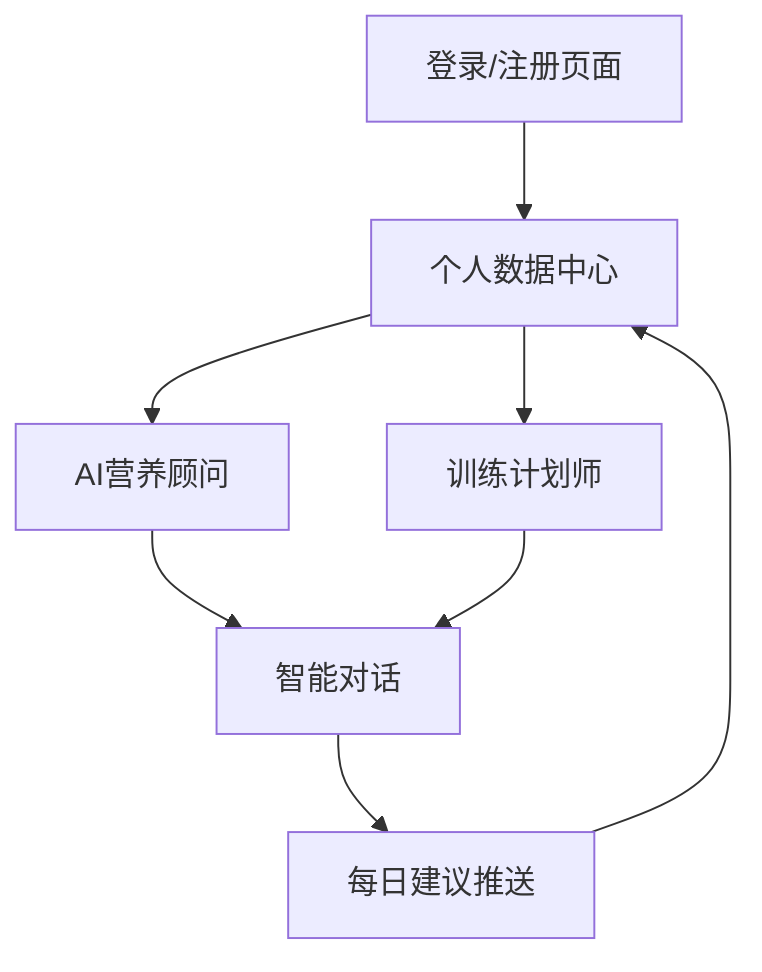

## 1. 产品概述
FitKeeper是一款AI健身伴侣应用，通过智能算法为用户提供个性化的营养摄入建议和训练计划。基于用户的身体数据，精确计算每日所需的碳水化合物、蛋白质和脂肪摄入量，并提供详细的食物搭配建议。同时为有力量训练需求的用户制定科学的增肌计划，成为用户健康减脂路上的智能伙伴。

目标用户群体：希望健康减脂的健身爱好者、需要科学饮食指导的用户、追求力量提升的健身人群。

## 2. 核心功能

### 2.1 用户角色
| 角色 | 注册方式 | 核心权限 |
|------|----------|----------|
| 用户 | 手机号/邮箱注册 | 基础数据录入、获取营养建议、查看训练计划、个性化AI对话、高级训练计划、营养数据深度分析 |

### 2.2 功能模块
FitKeeper主要包含以下核心页面：
1. **个人数据中心**：用户身体数据录入、历史数据展示、目标设定
2. **AI营养顾问**：营养摄入计算、食物推荐、食谱推送
3. **训练计划师**：力量训练计划制定、进度追踪、动作指导
4. **智能对话**：与AI健身助手对话、获取个性化建议

### 2.3 页面详情
| 页面名称 | 模块名称 | 功能描述 |
|----------|----------|----------|
| 个人数据中心 | 身体数据录入 | 输入身高、体重、年龄、性别、活动水平等基础信息 |
| 个人数据中心 | 目标设定 | 设置减脂目标体重、目标时间、训练频率等 |
| 个人数据中心 | 历史记录 | 查看体重变化曲线、营养摄入历史、训练完成情况 |
| AI营养顾问 | 营养计算 | 基于身体数据自动计算每日碳水、蛋白质、脂肪需求量 |
| AI营养顾问 | 食物推荐 | 推荐具体食物克数（鸡胸肉200g、燕麦50g等） |
| AI营养顾问 | 食谱推送 | 生成一日三餐详细食谱，包含烹饪方法 |
| 训练计划师 | 计划制定 | 根据用户水平制定力量训练计划（如卧推提升方案） |
| 训练计划师 | 动作库 | 提供标准动作示范、注意事项、重量建议 |
| 训练计划师 | 进度追踪 | 记录训练数据、生成进步曲线、调整训练强度 |
| 智能对话 | AI助手 | 24小时在线健身问答、鼓励陪伴、个性化建议 |
| 用户认证 | 注册登录 | 手机号/邮箱注册、密码登录、第三方登录 |

## 3. 核心流程
用户首次使用流程：用户注册 → 录入身体数据 → 设定健身目标 → AI生成营养建议 → 获取训练计划 → 日常记录与追踪 → AI持续优化建议

老用户流程：登录 → 查看最新建议 → 记录当日数据 → 获取明日计划 → 与AI对话答疑

## 4. 用户界面设计

### 4.1 设计风格
- **主色调**：活力橙色(#FF6B35)搭配深空灰(#2C3E50)
- **按钮样式**：圆角矩形，橙色渐变，悬停效果
- **字体选择**：思源黑体，标题18-24px，正文14-16px
- **布局风格**：卡片式布局，清晰分区，数据可视化图表
- **图标风格**：线性图标，简洁现代，健身主题emoji

### 4.2 页面设计概览
| 页面名称 | 模块名称 | UI元素 |
|----------|----------|--------|
| 个人数据中心 | 数据录入卡片 | 白色圆角卡片、输入框带图标、渐变提交按钮 |
| 个人数据中心 | 数据可视化 | 曲线图表展示体重变化、彩色进度条显示目标完成度 |
| AI营养顾问 | 营养环形图 | 三色环形图展示营养比例、悬停显示具体克数 |
| AI营养顾问 | 食物推荐卡片 | 食物图片+克数+营养信息，横向滑动浏览 |
| 训练计划师 | 训练日历 | 月历视图标记训练日、不同颜色区分训练类型 |
| 训练计划师 | 动作展示 | GIF动图演示、重量选择滑块、完成度勾选 |
| 智能对话 | 聊天界面 | 气泡式对话、语音输入按钮、快捷回复选项 |

### 4.3 响应式设计
采用桌面端优先设计，适配1200px以上大屏显示完整数据图表；平板端优化为两栏布局；手机端单列显示，重点突出核心功能，底部导航栏便于单手操作。触摸交互优化，支持滑动切换、长按详情等手势操作。

### 4.4 动效设计
页面切换采用平滑过渡动画，数据更新时有数字跳动效果，图表绘制采用渐进式动画，增强用户体验的流畅感和科技感。