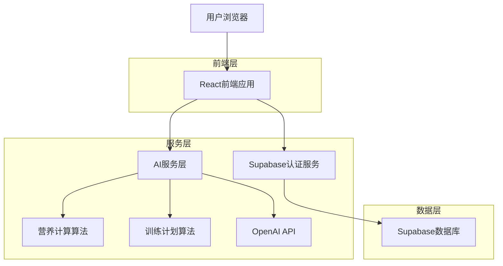
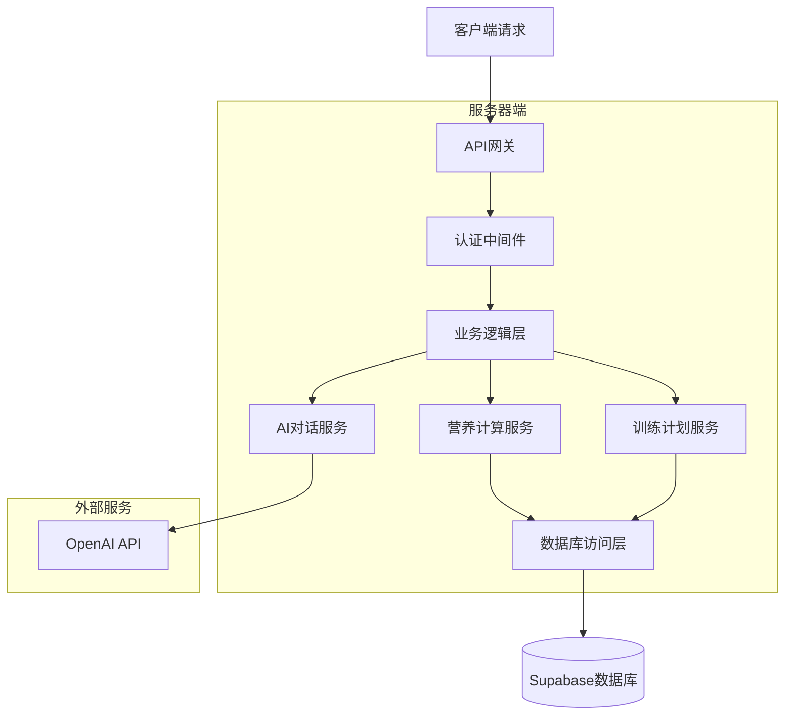
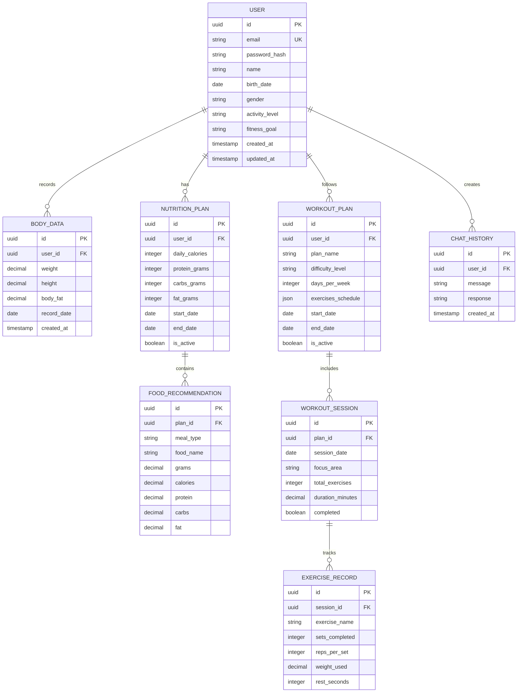

## 1. 架构设计



## 2. 技术描述

- **前端**: React@18 + TypeScript + TailwindCSS@3 + Vite
- **初始化工具**: vite-init
- **后端**: Supabase (内置认证、数据库、存储)
- **AI服务**: OpenAI API (GPT-4 for personalized recommendations)
- **图表库**: Chart.js + react-chartjs-2
- **状态管理**: React Context + useReducer
- **移动端**: PWA支持

## 3. 路由定义

| 路由 | 用途 |
|------|------|
| / | 首页，产品功能介绍和登录入口 |
| /dashboard | 个人数据中心，展示用户概览 |
| /nutrition | AI营养顾问页面，营养计算和建议 |
| /workout | 训练计划师页面，制定训练计划 |
| /chat | 智能对话页面，与AI助手交流 |
| /profile | 用户资料设置页面 |
| /login | 用户登录页面 |
| /register | 用户注册页面 |

## 4. API定义

### 4.1 用户认证API

```
POST /auth/register
```

请求：
| 参数名 | 参数类型 | 是否必需 | 描述 |
|--------|----------|----------|------|
| email | string | true | 用户邮箱 |
| password | string | true | 用户密码 |
| name | string | true | 用户姓名 |
| phone | string | false | 手机号 |

响应：
```json
{
  "user": {
    "id": "uuid",
    "email": "user@example.com",
    "name": "张三"
  },
  "session": "jwt_token"
}
```

### 4.2 营养计算API

```
POST /api/nutrition/calculate
```

请求：
| 参数名 | 参数类型 | 是否必需 | 描述 |
|--------|----------|----------|------|
| weight | number | true | 体重(kg) |
| height | number | true | 身高(cm) |
| age | number | true | 年龄 |
| gender | string | true | 性别(male/female) |
| activity_level | string | true | 活动水平 |
| goal | string | true | 目标(减脂/增肌/维持) |

响应：
```json
{
  "calories": 2200,
  "protein": 165,
  "carbs": 275,
  "fat": 73,
  "protein_grams": "鸡胸肉200g",
  "carbs_grams": "燕麦80g + 米饭150g",
  "fat_grams": "橄榄油15g + 坚果30g"
}
```

### 4.3 训练计划API

```
POST /api/workout/generate-plan
```

请求：
| 参数名 | 参数类型 | 是否必需 | 描述 |
|--------|----------|----------|------|
| user_id | string | true | 用户ID |
| experience | string | true | 训练经验(beginner/intermediate/advanced) |
| goal | string | true | 训练目标 |
| equipment | array | true | 可用器械 |
| days_per_week | number | true | 每周训练天数 |

响应：
```json
{
  "plan_id": "uuid",
  "workouts": [
    {
      "day": "周一",
      "focus": "胸部训练",
      "exercises": [
        {
          "name": "杠铃卧推",
          "sets": 4,
          "reps": "8-12",
          "weight": "60kg",
          "rest": "90秒"
        }
      ]
    }
  ]
}
```

## 5. 服务器架构图



## 6. 数据模型

### 6.1 数据模型定义



### 6.2 数据定义语言

用户表(users)
```sql
-- 创建用户表
CREATE TABLE users (
    id UUID PRIMARY KEY DEFAULT gen_random_uuid(),
    email VARCHAR(255) UNIQUE NOT NULL,
    password_hash VARCHAR(255) NOT NULL,
    name VARCHAR(100) NOT NULL,
    birth_date DATE,
    gender VARCHAR(10) CHECK (gender IN ('male', 'female')),
    activity_level VARCHAR(20) CHECK (activity_level IN ('sedentary', 'light', 'moderate', 'active', 'very_active')),
    fitness_goal VARCHAR(20) CHECK (fitness_goal IN ('lose_weight', 'gain_muscle', 'maintain')),
    created_at TIMESTAMP WITH TIME ZONE DEFAULT NOW(),
    updated_at TIMESTAMP WITH TIME ZONE DEFAULT NOW()
);

-- 创建索引
CREATE INDEX idx_users_email ON users(email);
CREATE INDEX idx_users_created_at ON users(created_at DESC);

-- 授权
GRANT SELECT ON users TO anon;
GRANT ALL PRIVILEGES ON users TO authenticated;
```

身体数据表(body_data)
```sql
-- 创建身体数据表
CREATE TABLE body_data (
    id UUID PRIMARY KEY DEFAULT gen_random_uuid(),
    user_id UUID REFERENCES users(id) ON DELETE CASCADE,
    weight DECIMAL(5,2) NOT NULL,
    height DECIMAL(5,2) NOT NULL,
    body_fat DECIMAL(4,2),
    record_date DATE NOT NULL,
    created_at TIMESTAMP WITH TIME ZONE DEFAULT NOW()
);

-- 创建索引
CREATE INDEX idx_body_data_user_id ON body_data(user_id);
CREATE INDEX idx_body_data_record_date ON body_data(record_date DESC);

-- 授权
GRANT SELECT ON body_data TO anon;
GRANT ALL PRIVILEGES ON body_data TO authenticated;
```

营养计划表(nutrition_plans)
```sql
-- 创建营养计划表
CREATE TABLE nutrition_plans (
    id UUID PRIMARY KEY DEFAULT gen_random_uuid(),
    user_id UUID REFERENCES users(id) ON DELETE CASCADE,
    daily_calories INTEGER NOT NULL,
    protein_grams INTEGER NOT NULL,
    carbs_grams INTEGER NOT NULL,
    fat_grams INTEGER NOT NULL,
    start_date DATE NOT NULL,
    end_date DATE,
    is_active BOOLEAN DEFAULT true,
    created_at TIMESTAMP WITH TIME ZONE DEFAULT NOW()
);

-- 创建索引
CREATE INDEX idx_nutrition_plans_user_id ON nutrition_plans(user_id);
CREATE INDEX idx_nutrition_plans_active ON nutrition_plans(is_active);

-- 授权
GRANT SELECT ON nutrition_plans TO anon;
GRANT ALL PRIVILEGES ON nutrition_plans TO authenticated;
```

食物推荐表(food_recommendations)
```sql
-- 创建食物推荐表
CREATE TABLE food_recommendations (
    id UUID PRIMARY KEY DEFAULT gen_random_uuid(),
    plan_id UUID REFERENCES nutrition_plans(id) ON DELETE CASCADE,
    meal_type VARCHAR(20) CHECK (meal_type IN ('breakfast', 'lunch', 'dinner', 'snack')),
    food_name VARCHAR(100) NOT NULL,
    grams DECIMAL(6,2) NOT NULL,
    calories DECIMAL(6,2) NOT NULL,
    protein DECIMAL(5,2) NOT NULL,
    carbs DECIMAL(5,2) NOT NULL,
    fat DECIMAL(5,2) NOT NULL,
    created_at TIMESTAMP WITH TIME ZONE DEFAULT NOW()
);

-- 创建索引
CREATE INDEX idx_food_recommendations_plan_id ON food_recommendations(plan_id);
CREATE INDEX idx_food_recommendations_meal_type ON food_recommendations(meal_type);

-- 授权
GRANT SELECT ON food_recommendations TO anon;
GRANT ALL PRIVILEGES ON food_recommendations TO authenticated;
```

训练计划表(workout_plans)
```sql
-- 创建训练计划表
CREATE TABLE workout_plans (
    id UUID PRIMARY KEY DEFAULT gen_random_uuid(),
    user_id UUID REFERENCES users(id) ON DELETE CASCADE,
    plan_name VARCHAR(100) NOT NULL,
    difficulty_level VARCHAR(20) CHECK (difficulty_level IN ('beginner', 'intermediate', 'advanced')),
    days_per_week INTEGER NOT NULL CHECK (days_per_week BETWEEN 1 AND 7),
    exercises_schedule JSONB NOT NULL,
    start_date DATE NOT NULL,
    end_date DATE,
    is_active BOOLEAN DEFAULT true,
    created_at TIMESTAMP WITH TIME ZONE DEFAULT NOW()
);

-- 创建索引
CREATE INDEX idx_workout_plans_user_id ON workout_plans(user_id);
CREATE INDEX idx_workout_plans_active ON workout_plans(is_active);

-- 授权
GRANT SELECT ON workout_plans TO anon;
GRANT ALL PRIVILEGES ON workout_plans TO authenticated;
```

对话历史表(chat_history)
```sql
-- 创建对话历史表
CREATE TABLE chat_history (
    id UUID PRIMARY KEY DEFAULT gen_random_uuid(),
    user_id UUID REFERENCES users(id) ON DELETE CASCADE,
    message TEXT NOT NULL,
    response TEXT NOT NULL,
    created_at TIMESTAMP WITH TIME ZONE DEFAULT NOW()
);

-- 创建索引
CREATE INDEX idx_chat_history_user_id ON chat_history(user_id);
CREATE INDEX idx_chat_history_created_at ON chat_history(created_at DESC);

-- 授权
GRANT SELECT ON chat_history TO anon;
GRANT ALL PRIVILEGES ON chat_history TO authenticated;
```